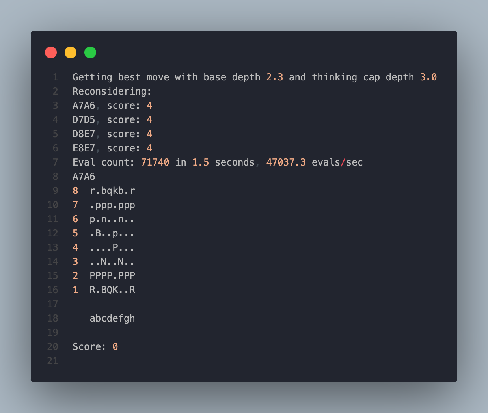

# sage-chess

<div align="center">
  <h1>🌿🌱<b>Sage-Chess</b>🪴🍃</h1>
  <p>
    <strong>A chess engine in <a href="https://adam-mcdaniel.net/sage-website">my own programming language!<a></strong>
  </p>
  <p float="left">
    
    <a href="https://adam-mcdaniel.net/sage-website"></a>
  </p>
  <!-- [***Here's a link to the online compiler playground!***](https://adam-mcdaniel.net/sage)
  [***Here's a link to the online compiler playground!***](https://adam-mcdaniel.net/sage) -->
</div>

## 🧐 About

This is a chess engine written in the [Sage programming language](https://adam-mcdaniel.github.io/sage-website/). I wanted to stress-test the language and see if it could handle the high computational requirements of a chess engine. I've really enjoyed getting it to work and seeing it perform well!

## 📦 Features

The engine aims to be complete, with the following features:

- [x] Move generation
- [x] Board representation
- [x] Board evaluation
- [x] Alpha-beta pruning
- [x] Bitboards
- [x] FEN parsing
- [x] Non-queen promotion

It's also designed to be expressive and easy to use. If you want to make a custom board state, you can do it like so:

```rs
let mut b = Board.empty();
// Add a white king and pawn on E1 and E2, respectively
b.add_piece(Piece.new(PieceType of King, Color of White, Position.E1));
b.add_piece(Piece.new(PieceType of Pawn, Color of White, Position.E2));

// Add a black king and pawn on E8 and E7, respectively
b.add_piece(Piece.new(PieceType of King, Color of Black, Position.E8));
b.add_piece(Piece.new(PieceType of Pawn, Color of Black, Position.E7));

// Move the white pawn to E4 and change the turn
b.turn(Position.E2.to(Position.E4));
// Print the board
b.println();
```

It's also easy to get the best move for a given board state:

```rs
// Use a standard FEN string to create a board
let mut b = Board.from_fen(&"r1bqkbnr/pppp1ppp/2n5/4p3/4P3/5N2/PPPP1PPP/RNBQKB1R w KQkq - 2 3");
// Print the board
b.println();
// Get the best move for the current player
let best_move = b.get_best_move();
// Print the best move
best_move.println();
// Make the best move
b.turn(best_move);
// Print the board
b.println();
```

So you can easily use this for whatever you need!

## 🚀 Quick Start

First, you'll need to follow the [installation instructions for the Sage programming language](https://adam-mcdaniel.github.io/sage-website/installs/install/).
Then, you can clone the repository and start running the chess engine:

```bash
$ git clone https://github.com/adam-mcdaniel/sage-chess
$ cd sage-chess
$ sage -tc src/main.sg
$ gcc out.c -Ofast -flto -o chess
$ ./chess
```

## 📚 Importing Into Your Code

To import the chess engine into your code, simply import the `src/chess.sg` file. First, move the `src/chess.sg` file into your project directory. Then, you can import the file like so:

```rs
// file: main.sg
mod chess;
from chess import *;
```

Then, you can start to use the chess engine!

```rs
// file: main.sg (continued...)
let mut b = Board.from_fen(&"r1bqkbnr/pppp1ppp/2n5/4p3/4P3/5N2/PPPP1PPP/RNBQKB1R w KQkq - 2 3");
b.println();

// Make 10 moves, 5 for each side
for let mut j=0; j<10; j+=1; {
    // Get the best move for the current player
    let move = b.get_best_move();
    // Print the move
    move.println();
    // Make the move
    b.turn(move);
    // Print the board and the score
    b.println();
    println("Score: ", b.material_score());
}
```

<!-- FFI header -->
## 🤝 FFI

The chess engine uses two C functions: one to simplify bitboard operations, and the other to get the system time in order to print the time it took to calculate the best move. The C functions are defined in the `ffi.h` file. The functions are as follows:

```c
// Provides the engine with a faster way to count the number of "on" bits in a 64-bit integer
void __count_bits();

// Provides the engine with a way to get the system time
void __get_time();
```

These functions will automatically be compiled in when you compile the resulting `out.c` file generated by `sage -tc src/main.sg`.

## 📝 License

This project is licensed under the MIT License - see the [LICENSE](LICENSE) file for details.

<!-- About the author -->
## ✍️ Author

[I'm currently a PhD student at the University of Tennessee, Knoxville](https://adam-mcdaniel.net). I like to make things, especially programming languages. I've written [other](https://github.com/adam-mcdaniel/chess-engine) [engines](https://github.com/adam-mcdaniel/capitalist-chess) before, but this is my first in my own language. I hope you enjoy it!